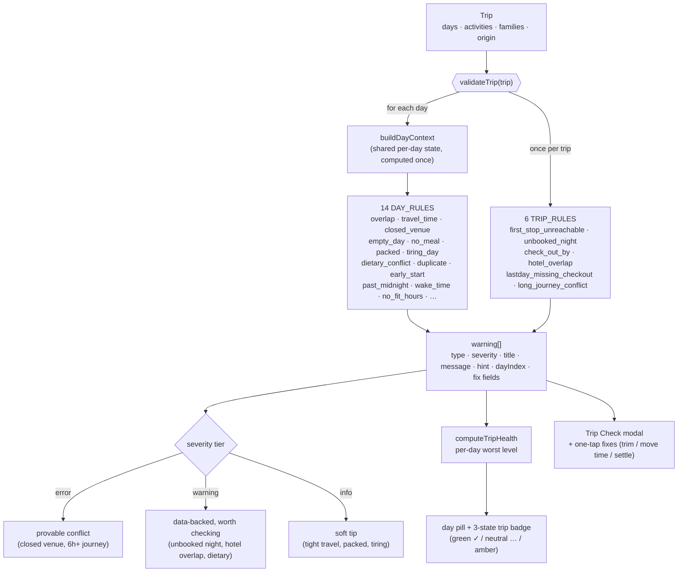
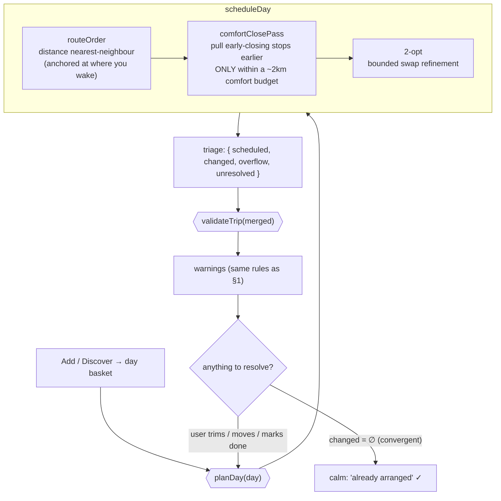
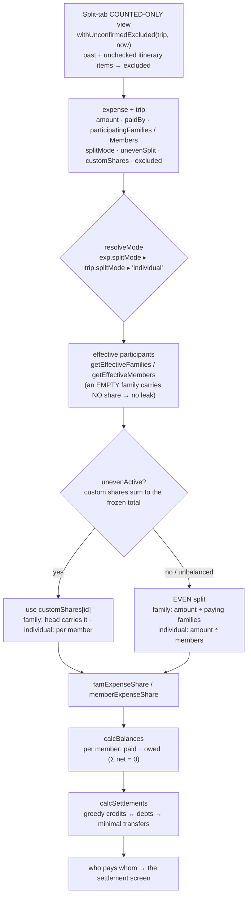

# Kithova — rule engines, visualized

Three deterministic, pure engines power the experience — **Trip Check** (§1), the **planner** (§2),
and the **split/settlement moat** (§3). This doc is the **structure**
(how they're wired); for **behavior** (what actually fires for real trips) open the generated
**[`rule-report.html`](rule-report.html)** — run `npm run rule-report` to regenerate it from the
live `validateTrip()`. Together: the Mermaid below = the map, the report = the territory.

> Both diagrams render in GitHub and VS Code (Markdown Preview Mermaid Support) — all local, no
> external service.

---

## 1. Trip Check — `tripValidator.js`

A **rule registry**: `validateTrip(trip)` runs 14 per-day rules (each over a shared
`buildDayContext`) then 6 trip-level rules. Every rule is a pure `(ctx|trip) → warning[]`. The
output array is severity-tiered and consumed by the per-day pill, the trip badge, and the
Trip Check modal (which offers one-tap fixes like *Trim to N nights*).

**Severity tiers** (deliberately calm — no wall of red):

| Tier | Means | Examples |
|---|---|---|
| `error` | a **provable** conflict | venue closed that day, a 6h+ journey collision |
| `warning` | a real, **data-backed** thing worth checking | unbooked night, hotel overlap, dietary clash, duplicate |
| `info` | a soft **tip** (estimate-based) | tight travel time, packed day, tiring day, early/late edges |

**Locked by:** `tripValidator.snapshot.test.js` (the FULL output of every rule, golden-snapshotted
— a dropped/renamed/re-tiered rule shows up as a diff), plus `hotelOverlap.test.js`.

---

## 2. Planner — `autoArrange.js`, and the plan ⇄ check loop

`planDay` schedules a day, then Trip Check validates the result. The two share one engine —
*"one engine PLACES, the same engine CHECKS"* — so the inline cue and the warning always agree.
The loop is **convergent**: once a re-tap produces no changes, it reports a calm "already arranged"
instead of re-alerting (the fix for the old endless-cycle feeling).

**Honest triage** (`{ scheduled, changed, overflow, unresolved }`) is what keeps the loop from
nagging: `overflow`/`unresolved` surface as a decision card (move-to-day / keep / remove) rather
than a repeating alert.

**Locked by:** `scheduleDay.test.js`, `twoOpt.test.js`, `comfortPass.test.js`,
`comfortClose.test.js`, `returnJourney.test.js`.

---

## 3. Split / settlement engine — `costs.js` (THE MOAT)

Not a *warning* engine — a **money-resolution** engine. Given an expense + the trip, it resolves
who owes what, then nets everyone and reduces to the minimum set of transfers. The decision logic
is the **mode** (family vs individual) × the **split kind** (even vs uneven/custom), guarded so the
books can never leak.

**The four resolution quadrants** (what `famExpenseShare` returns):

| | **Even** | **Uneven (balanced custom)** |
|---|---|---|
| **Family mode** | `amount ÷ paying families` | `customShares[familyId]` (head carries) |
| **Individual mode** | `involved members × (amount ÷ members)` | Σ family's members' `customShares[memberId]` |

**Mode is a trip default, overridable per expense.** `By Person` / `By Group` is the trip-level
`splitMode`; any single expense can override it (`exp.splitMode`) and can be **even or custom**
(uneven) — e.g. an Airbnb split *by room* in `By Group`. The toggle copy says "equal by default —
open any expense to set custom amounts" so users know custom exists.

**Invariants the engine guarantees** (and that `costs.test.js` pins):
- **No leak:** an empty participating family — or an expense nobody shares — is *not* in the ledger; crediting the payer for it would invent money (Σ net ≠ 0).
- **Excluded never counts:** an `excluded` expense is out of every total / balance / transfer. The Split tab feeds a **counted-only view** (`withUnconfirmedExcluded`, see below) so the split divides only confirmed spend.
- **Uneven only when balanced:** custom shares drive settlement *only* if they sum to the (frozen) `amount`; an in-progress edit safely falls back to the even split.
- **Family mode → only the head** of a family carries its share; dependents owe 0.
- **`estimatedAmount` is frozen** — only `amount` ever changes (see AGENTS.md invariants).

**Unconfirmed spend — auto-excluded until checked (the "did this happen?" rule).** Once an
activity's time has **passed**, if it was never checked off (`status` ≠ `done`/`skipped`) but
carries a non-excluded itinerary expense, it **drops out of the split until confirmed** — so the
group never divides money for something we can't confirm happened. Mechanics, kept off the moat:
- `unconfirmedSplitItems(trip, now)` (in `expenses.js`) finds them — **pure + time-aware** (`now`
  is passed in, never read inside the engine). Only **past** events qualify; **future** items always
  count (they're the pre-trip estimate).
- `withUnconfirmedExcluded(trip, now)` returns a **view** of the trip where those expenses are
  marked `excluded`. The Split tab feeds this view to *all* the money math (totals, balances,
  settlement, per-family/-member) **and** the settlement PDF — so on-screen and shared numbers agree.
  `costs.js` is **untouched**: the engine stays clock-free + deterministic; the time-awareness lives
  entirely at the caller.
- **Surface:** each unconfirmed row shows amber + "⚠️ Not counted" with a left-**swipe** →
  **✓ Checked** (mark done → counts) · **🚫 Exclude** (out for good) · **➜ Open** (jump to the
  itinerary), plus a summary banner. Checking it off restores it to the split automatically next
  render (no stored mutation). Decision (owner): **post-event only** — never nags about a future stop.

**Multiple payers (engine + store ready; UI deferred).** An expense can carry `payments:
[{ memberId, amount }]` so a single bill can be **co-paid** (e.g. a $300 restaurant split 3 ways
but only 2 families' cards worked → each pays $150). `paymentsOf(exp, trip)` uses it only when it's
**valid + balanced** (payers are current members AND amounts sum to `exp.amount`), else falls back
to the single `paidBy` — so the books can never leak. Who-*paid* only touches the *paid* side; the
split/owed math and `calcSettlements` are unchanged, so co-paid settlements just work. Same-family
or cross-family payers both work (payments are per-member; `calcFamilyBalances` sums each family's).
Set via `updateExpensePayments`; member-delete re-homes a payer's amount to the heir. **Single-payer
stays the default; the multi-payer *UI* is intentionally not built yet.**

**Locked by:** `costs.test.js` (direct, 99% stmts) + `splitEngine.regression.test.js` /
`splitDelete.regression.test.js` (every mode, a 500-trip property fuzz, delete-flow balance) +
`unconfirmedSplit.test.js` (the time-aware unconfirmed finder + the counted-only view).

> ⚠️ Per the roadmap: **never let AI touch the money inside this engine.** It stays deterministic.

---

## 4. Why a generated report (not just diagrams)

The rules are **pure + deterministic + fixture-backed**, so the most trustworthy view is one drawn
from the engine itself, not hand-drawn. `scripts/gen-rule-report.js` runs the real `validateTrip()`
over illustrative sample trips and emits `rule-report.html` — a rule catalog (every type seen, its
tier, a real example) + per-trip results, colour-coded by severity. It **can't drift** from the
code. The Mermaid here gives the wiring the report can't; the report gives the behaviour the wiring
can't. Re-run after any rule change: `npm run rule-report`.
