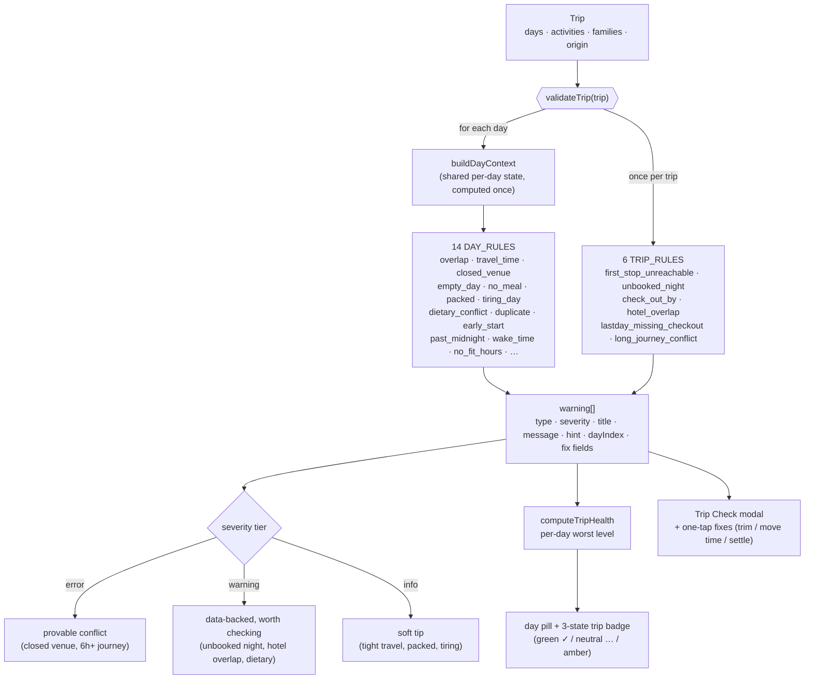
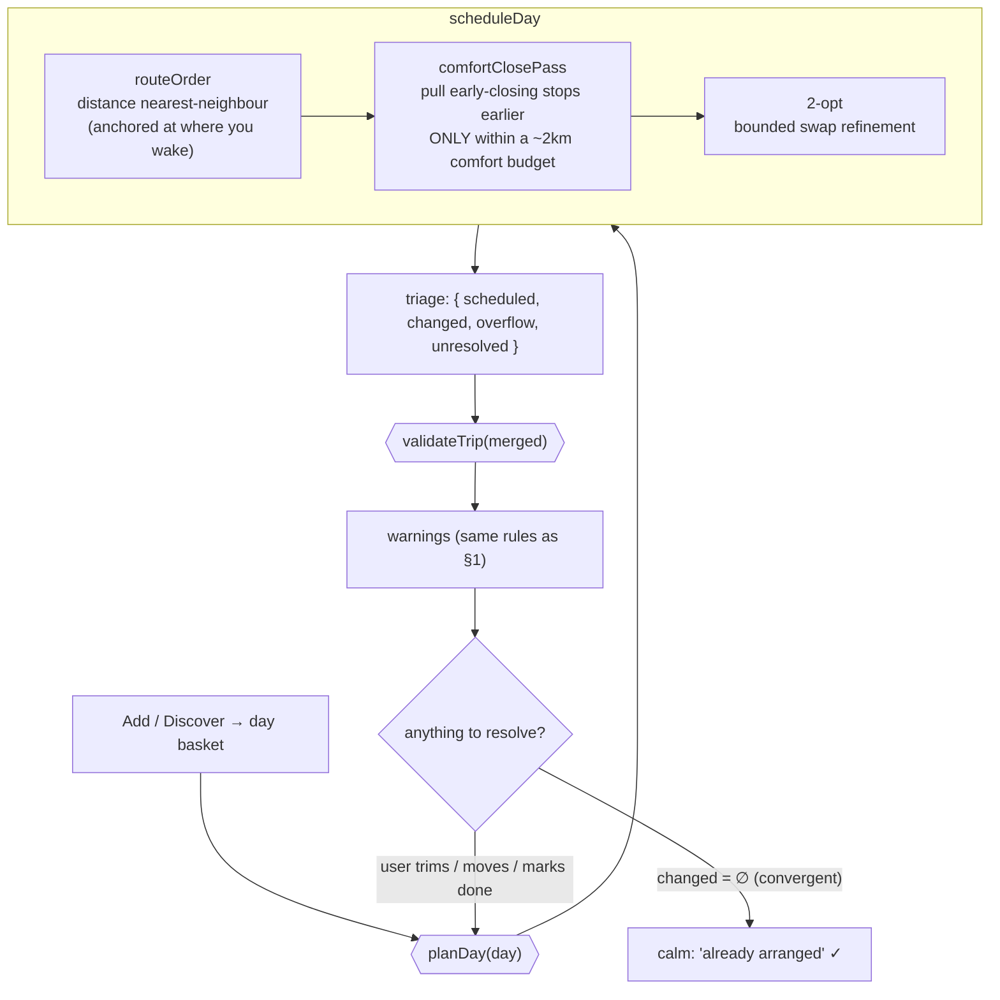

# Voyara — rule engines, visualized

Two deterministic, pure engines power the planning experience. This doc is the **structure**
(how they're wired); for **behavior** (what actually fires for real trips) open the generated
**[`rule-report.html`](rule-report.html)** — run `npm run rule-report` to regenerate it from the
live `validateTrip()`. Together: the Mermaid below = the map, the report = the territory.

> Both diagrams render in GitHub and VS Code (Markdown Preview Mermaid Support) — all local, no
> external service.

---

## 1. Trip Check — `tripValidator.js`

A **rule registry**: `validateTrip(trip)` runs 14 per-day rules (each over a shared
`buildDayContext`) then 6 trip-level rules. Every rule is a pure `(ctx|trip) → warning[]`. The
output array is severity-tiered and consumed by the per-day pill, the trip badge, and the
Trip Check modal (which offers one-tap fixes like *Trim to N nights*).

**Severity tiers** (deliberately calm — no wall of red):

| Tier | Means | Examples |
|---|---|---|
| `error` | a **provable** conflict | venue closed that day, a 6h+ journey collision |
| `warning` | a real, **data-backed** thing worth checking | unbooked night, hotel overlap, dietary clash, duplicate |
| `info` | a soft **tip** (estimate-based) | tight travel time, packed day, tiring day, early/late edges |

**Locked by:** `tripValidator.snapshot.test.js` (the FULL output of every rule, golden-snapshotted
— a dropped/renamed/re-tiered rule shows up as a diff), plus `hotelOverlap.test.js`.

---

## 2. Planner — `autoArrange.js`, and the plan ⇄ check loop

`planDay` schedules a day, then Trip Check validates the result. The two share one engine —
*"one engine PLACES, the same engine CHECKS"* — so the inline cue and the warning always agree.
The loop is **convergent**: once a re-tap produces no changes, it reports a calm "already arranged"
instead of re-alerting (the fix for the old endless-cycle feeling).

**Honest triage** (`{ scheduled, changed, overflow, unresolved }`) is what keeps the loop from
nagging: `overflow`/`unresolved` surface as a decision card (move-to-day / keep / remove) rather
than a repeating alert.

**Locked by:** `scheduleDay.test.js`, `twoOpt.test.js`, `comfortPass.test.js`,
`comfortClose.test.js`, `returnJourney.test.js`.

---

## 3. Why a generated report (not just diagrams)

The rules are **pure + deterministic + fixture-backed**, so the most trustworthy view is one drawn
from the engine itself, not hand-drawn. `scripts/gen-rule-report.js` runs the real `validateTrip()`
over illustrative sample trips and emits `rule-report.html` — a rule catalog (every type seen, its
tier, a real example) + per-trip results, colour-coded by severity. It **can't drift** from the
code. The Mermaid here gives the wiring the report can't; the report gives the behaviour the wiring
can't. Re-run after any rule change: `npm run rule-report`.
