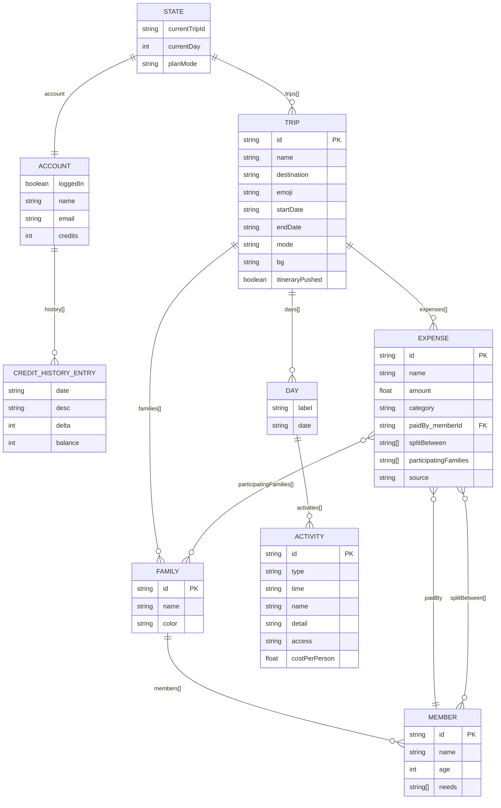
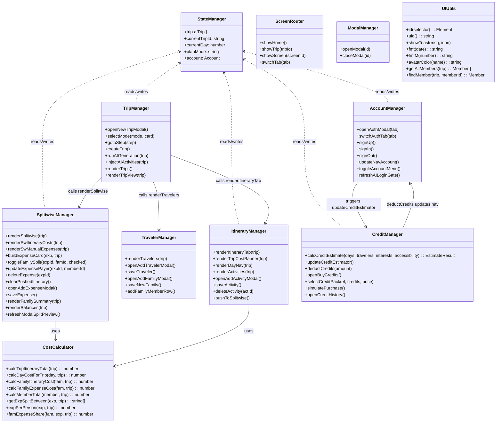
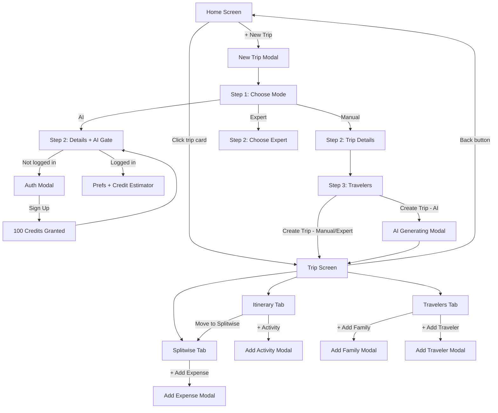

# VoyVibe — Technical Documentation
> Version 1.2 · June 2026 · Active app: `VoyVibeFresh/`

---

## ⚠️ IMPORTANT FOR AI AGENTS

**Read `voyvibe-agent-context.md` first.** It contains the complete system design, architecture, gotchas, and step-by-step implementation patterns — everything needed to continue development without re-deriving context.

---

## Version History

| Version | Date | What Changed |
|---|---|---|
| 1.0 | May 2026 | Initial web SPA (`travel-planner.html`) — vanilla JS, single file, in-memory state |
| 1.1 | May 2026 | React Native rebuild (`VoyVibeApp/`) — Expo SDK 54, Zustand, React Navigation, AsyncStorage |
| 1.2 | June 2026 | Identified `VoyVibeFresh/` as active app · Trip validation engine · Tappable validation cards with navigation · Check Trip FAB · StyleSheet repair |

---

## What a New Agent Needs to Know First

**The active codebase is `VoyVibeFresh/`** — NOT `VoyVibeApp/`. This was confirmed in June 2026 when a screenshot revealed the running app has tab labels "Plan / People / Split" matching VoyVibeFresh, not the older VoyVibeApp scaffold.

The `travel-planner.html` file is the original web prototype — read it for business logic reference only; do not modify it.

**State management:** Zustand store at `src/store/index.js`. All mutations go through store actions. No direct state mutation outside the store.

**Key invariant:** `expense.participatingFamilies[]` is always the source of truth for expense splitting — never `splitBetween[]`. Use `getExpSplitBetween(exp, trip)` from `src/utils/costs.js` for all split math.

**Day ordering:** Activities within a day are always sorted by `activity.time` (HH:MM) at render time. There is no separate display-order field. Reordering = swapping time values.

**No backend yet.** Auth, payments, and AI generation are all simulated. Data persists via AsyncStorage (Zustand `persist` middleware).

---

## v1.2 Feature Details — June 2026

### Feature 1: Activity Reordering (Long-Press)

**Problem:** Users had no way to change the order of activities in a day without editing each activity's time manually.

**Solution:** Long-press any activity card → enter reorder mode. Select a card, then tap ↑ or ↓ to move it. Moving swaps the `time` value between the two activities, which keeps the time-based sort consistent.

**Files changed:**

| File | Change |
|---|---|
| `src/store/index.js` | Added `reorderActivities(tripId, dayIndex, actId, direction)` action |
| `src/screens/ItineraryScreen.js` | Reorder mode state, `Pressable` long-press handler, ↑↓ UI, haptics via `expo-haptics` |

**Store action — `reorderActivities`:**
```js
reorderActivities(tripId, dayIndex, actId, 'up' | 'down')
// Sorts activities by time, finds actId's position, swaps time with neighbor
// Result: activities re-sort into the new intended order
```

**UX flow:**
1. Long press (350ms delay) → `ImpactFeedbackStyle.Medium` haptic → reorder mode ON
2. Selected card: highlighted border + scale(1.015) + ↑↓ buttons replace delete button
3. Other cards: dimmed (opacity 0.55) + drag handle (☰) shown
4. Tap a different card → switches selection (`selectionAsync` haptic)
5. ↑ / ↓ → `ImpactFeedbackStyle.Light` haptic + time swap
6. "Done" → `NotificationFeedbackType.Success` haptic → reorder mode OFF
7. Switching day tabs auto-exits reorder mode

**Edge cases handled:**
- ↑ disabled when card is already first; ↓ disabled when last
- No new npm packages required — uses existing `expo-haptics` + `Pressable`

---

### Feature 2: Trip Validation Engine

**Problem:** Users had no way to detect time overlaps or scheduling issues. Activities have a start time but no end time, so overlap detection requires duration estimation.

**Solution:** A two-part system — a duration estimator (keyword + type rules) and a full trip validator that returns structured issues.

**Files added:**

| File | Purpose |
|---|---|
| `src/utils/tripValidator.js` | Duration estimation rules + `validateTrip(trip)` function |
| `src/modals/TripValidationModal.js` | UI modal showing issues grouped by severity |

**Files changed:**

| File | Change |
|---|---|
| `src/screens/ItineraryScreen.js` | "✅ Check Trip" button in banner, issue badges on activity cards, colored dots on day tabs |

#### Duration Estimation (`estimateDuration(activity)`)

Checks activity `name + detail` text against 30+ keyword patterns in priority order. Falls back to `activity.type` if no keyword matches.

Returns `{ min, max, label, tip }` (min/max in minutes).

Key duration rules (from travel industry data + TripAdvisor research):

| Activity | Min | Max |
|---|---|---|
| Museum / Gallery | 120m | 240m |
| Theme park (Disney, Universal…) | 360m | 480m |
| National park / Safari | 240m | 360m |
| Hike / Trek | 120m | 300m |
| Airport (check-in + security + boarding) | 150m | 210m |
| Guided / Walking tour | 120m | 180m |
| Dinner | 90m | 150m |
| Lunch | 60m | 90m |
| Breakfast | 30m | 60m |
| Spa / Wellness | 90m | 180m |
| Beach / Water activity | 120m | 240m |
| Boat / Cruise | 120m | 240m |
| Transfer / Taxi | 30m | 90m |
| Hotel check-in | 20m | 45m |
| Show / Concert | 120m | 180m |
| Shopping | 60m | 120m |

#### Validation Rules (`validateTrip(trip)`)

Returns `Suggestion[]` — each item has `{ severity, type, title, message, suggestion, dayIndex?, actIds? }`.

| Rule | Severity | Logic |
|---|---|---|
| Hard overlap | `error` | `nextStart < currStart + dur.min` |
| Tight schedule | `warning` | `nextStart < currStart + avgDur` |
| No meals on a busy day | `warning` | `type === 'food'` count = 0 when 2+ other activities exist |
| Empty day | `warning` | `activities.length === 0` and other days have activities |
| No accommodation | `warning` | No `type === 'stay'` activity anywhere in trip |
| Pace overload | `warning` | 5+ activities + traveler has wheelchair/elderly/infant need |
| No arrival transport Day 1 | `info` | No `type === 'transport'` on `days[0]` |
| Early start without breakfast | `info` | First activity before 09:00 and no food before 10:00 |
| Late evening without dinner | `info` | Last activity after 18:00 and no food after 17:00 |
| Budget concentration | `info` | One day > 60% of total trip cost |

**Notes field `actIds`** — present on overlap/tight issues. The `ItineraryScreen` uses this to render inline `🚫 Overlap` / `⚠️ Tight` badges directly on the affected activity cards.

#### Validation UI

- **Banner button:** `"✅ Check Trip"` → orange `"⚠️"` or red `"🚫"` with numeric badge when issues exist
- **Day tabs:** Small colored dot appears on days with errors/warnings
- **Activity cards:** Inline badge + colored border on cards involved in overlaps
- **`TripValidationModal`:** Full-screen sheet. Issues grouped: 🚫 Fix These → ⚠️ Worth Checking → 💡 Suggestions. Each card shows day label, message, and fix suggestion.

---

## 1. Product Overview

**VoyVibe** is a multi-family travel planning SPA (Single Page Application). It helps groups of families plan trips together with a shared daily itinerary, per-person cost estimates, accessibility tagging, and a full Splitwise-style expense splitting module.

### Core Feature Areas

| Area | Summary |
|---|---|
| Trip Management | Create, browse, and open trips with 3 planning modes |
| Itinerary | Per-day activity scheduling with cost-per-person and accessibility notes |
| Travelers | Multi-family roster with special needs tagging |
| Splitwise | Expense splitting with per-family participation control and settlement calculation |
| Account & Credits | Auth, 100 free credits on signup, TurboTax-style AI cost estimator |
| AI Planner | Credit-gated trip generation with simulated itinerary injection |

---

## 2. Architecture

### Pattern
- **Single-file HTML SPA** — no build step, no framework, no server
- Vanilla JS with a global `state` object as the single source of truth
- DOM is rebuilt on every state mutation (no virtual DOM / diffing)
- All data lives in-memory (no localStorage, no backend in v1)

### Screen Model
```
App
├── homeScreen       (trip list + hero)
└── tripScreen       (trip detail)
    ├── tab: itinerary
    ├── tab: travelers
    └── tab: splitwise
```

### Modal Model
| Modal ID | Trigger |
|---|---|
| `newTripModal` | "New Trip" nav button / hero CTA |
| `addActivityModal` | "+ Activity" or "+ Add Activity" button |
| `addExpenseModal` | "+ Expense" button |
| `addTravelerModal` | "+ Add Traveler" button |
| `addFamilyModal` | "+ Add Family" button (post-creation) |
| `authModal` | "Sign In" nav / AI gate |
| `buyCreditsModal` | "Buy Credits" from estimator or account menu |
| `aiGeneratingModal` | Auto-opened on AI trip creation |

---

## 3. Data Model

### 3.1 Entity Relationship Diagram (Mermaid)



### 3.2 Field Reference

#### `Trip`
| Field | Type | Description |
|---|---|---|
| `id` | `string` | Unique ID (`uid()` generated) |
| `name` | `string` | Trip display name |
| `destination` | `string` | Free-text destination |
| `emoji` | `string` | Random emoji for card art |
| `startDate` | `string` | ISO date `YYYY-MM-DD` |
| `endDate` | `string` | ISO date `YYYY-MM-DD` |
| `mode` | `'manual'\|'ai'\|'expert'` | Planning mode |
| `bg` | `string` | CSS gradient for card header |
| `itineraryPushed` | `boolean` | Whether activities have been pushed to Splitwise |
| `families` | `Family[]` | All family groups |
| `days` | `Day[]` | One entry per calendar day |
| `expenses` | `Expense[]` | All expenses (manual + itinerary-pushed) |

#### `Family`
| Field | Type | Description |
|---|---|---|
| `id` | `string` | Unique ID |
| `name` | `string` | Family display name |
| `color` | `string` | Hex color for UI differentiation |
| `members` | `Member[]` | All travelers in this family |

#### `Member`
| Field | Type | Description |
|---|---|---|
| `id` | `string` | Unique ID |
| `name` | `string` | Full name |
| `age` | `number` | Age in years |
| `needs` | `string[]` | Accessibility tags (e.g. `['♿ Wheelchair', '🌿 Dietary']`) |

#### `Activity`
| Field | Type | Description |
|---|---|---|
| `id` | `string` | Unique ID |
| `type` | `'transport'\|'stay'\|'food'\|'activity'\|'note'` | Category |
| `time` | `string` | `HH:MM` 24-hour format |
| `name` | `string` | Title |
| `detail` | `string` | Additional notes |
| `access` | `string` | Accessibility notes for this activity |
| `costPerPerson` | `number` | Estimated cost in USD |

#### `Expense`
| Field | Type | Description |
|---|---|---|
| `id` | `string` | Unique ID |
| `name` | `string` | Description |
| `amount` | `number` | Total amount in USD |
| `category` | `string` | Emoji category (`'🏨'`, `'✈️'`, etc.) |
| `paidBy` | `string` | Member ID who paid |
| `participatingFamilies` | `string[]` | **Source of truth** — family IDs that share this expense |
| `splitBetween` | `string[]` | Derived at creation (may be stale — use `getExpSplitBetween()` instead) |
| `source` | `'manual'\|'itinerary'` | Whether user-entered or pushed from itinerary |

#### `Account`
| Field | Type | Description |
|---|---|---|
| `loggedIn` | `boolean` | Auth state |
| `name` | `string` | User display name |
| `email` | `string` | Email address |
| `credits` | `number` | Remaining credits |
| `history` | `CreditHistoryEntry[]` | Transaction log |

#### `CreditHistoryEntry`
| Field | Type | Description |
|---|---|---|
| `date` | `string` | ISO date `YYYY-MM-DD` |
| `desc` | `string` | Human-readable description |
| `delta` | `number` | Change (positive = credit, negative = deduction) |
| `balance` | `number` | Balance after this transaction |

---

## 4. Class / Module Diagram (Mermaid)



---

## 5. Key Business Logic

### 5.1 Expense Splitting Algorithm

The core invariant: **`participatingFamilies` is the source of truth**, not `splitBetween`.

```
getExpSplitBetween(exp, trip):
  if exp.participatingFamilies has entries:
    return all member IDs from those families
  else:
    return exp.splitBetween (legacy fallback)

perPersonCost = exp.amount / getExpSplitBetween(exp, trip).length

familyShare(fam, exp) =
  if fam not in participatingFamilies → 0
  else → fam.members.length × perPersonCost
```

**Constraints enforced:**
- At least one family must always participate in an expense (enforced in `toggleFamilySplit`)
- Changing the payer to someone from an excluded family auto-includes that family

### 5.2 Settlement Algorithm (Greedy)

```
For each member:
  balance = totalPaid - totalOwed

Sort members by balance descending.
credits[] = members with balance > 0.5
debts[]   = members with balance < -0.5

While credits and debts remain:
  amount = min(credits[0].balance, abs(debts[0].balance))
  emit: debts[0] → pays → credits[0] → amount
  reduce both by amount
  remove exhausted entries
```

### 5.3 Credit Estimation Formula

```
base          = 20   (always)
daysCost      = max(0, days - 1) × 3
travelersCost = max(0, travelers - 1) × 2
accessibility = 8    (if any accessibility need selected)
costEstimation = 5   (activity pricing layer, always)
interestsCost  = activeInterestChips × 1

total = base + daysCost + travelersCost + accessibility + costEstimation + interestsCost
```

### 5.4 Planning Modes

| Mode | Flow |
|---|---|
| `manual` | Trip created immediately; user adds activities manually |
| `ai` | Requires login + sufficient credits; shows animated progress bar; `injectAIActivities()` populates days with template activities |
| `expert` | Trip created immediately; toast says expert will contact within 24hrs |

### 5.5 Itinerary → Splitwise Push

1. Strip all expenses with `source === 'itinerary'`
2. For each activity across all days with `costPerPerson > 0`:
   - Total = `costPerPerson × allMembers.length`
   - Default `participatingFamilies` = all family IDs (user unchecks per card)
   - `paidBy` = first member (user updates per card)
3. Set `trip.itineraryPushed = true`
4. Switch to Splitwise tab

---

## 6. Screen & Navigation Flow



---

## 7. Component Inventory

### CSS Design Tokens (`:root`)

| Token | Value | Use |
|---|---|---|
| `--c-primary` | `#e86c3a` | Brand orange, CTAs |
| `--c-ai` | `#6c5ce7` | AI mode purple |
| `--c-expert` | `#0984e3` | Expert mode blue |
| `--c-green` | `#00b894` | Success, balances |
| `--c-red` | `#d63031` | Errors, debts |
| `--c-yellow` | `#fdcb6e` | Warnings, costs |
| `--radius` | `14px` | Card border radius |
| `--radius-sm` | `8px` | Input/chip border radius |
| `--shadow-lg` | `0 8px 32px rgba(0,0,0,.12)` | Modal shadows |

### Key UI Components

| Component | CSS Class | Description |
|---|---|---|
| Trip Card | `.trip-card` | Home screen grid card |
| Activity Card | `.activity-card` | Itinerary row with left-border type color |
| Expense Card | `.sw-exp-card` | Interactive Splitwise card with split table |
| Family Summary Card | `.family-summary-card` | Right panel, per-family totals |
| Balance Card | `.balance-card` | Net balances + settle-up list |
| Credit Estimator | `.cr-estimator` | TurboTax-style credit cost panel |
| Credit Pill | `.credit-pill` | Nav bar credit/account button |
| Account Menu | `.account-menu` | Dropdown from credit pill |
| Day Cost Strip | `.day-cost-strip` | Horizontal stats row above activities |
| Day Family Breakdown | `.day-family-breakdown` | Per-family cost pills |

### Activity Type Color Coding
| Type | Left-border Color |
|---|---|
| `transport` | `#0984e3` (blue) |
| `stay` | `#6c5ce7` (purple) |
| `food` | `#e17055` (salmon) |
| `activity` | `#00b894` (green) |
| `note` | `#fdcb6e` (yellow) |

---

## 8. Accessibility Features

- **Traveler needs** stored as string tags: `'♿ Wheelchair'`, `'👁️ Visual'`, `'👂 Hearing'`, `'🍼 Infant'`, `'🧓 Elderly'`, `'🌿 Dietary'`, `'💊 Medical'`
- **Activity accessibility notes** (`.access` field) shown as green `♿` tag on each activity card
- **Trip-level flag**: `trip.families.some(f => f.members.some(m => m.needs.length > 0))` drives the `♿ Accessible` trip tag
- Credit estimator adds 8 credits when accessibility layer is needed

---

## 9. Mobile Rebuild Guide

### Recommended Tech Stack

| Layer | Recommendation | Reason |
|---|---|---|
| Framework | React Native or Flutter | Both support iOS + Android from one codebase |
| State | Zustand (RN) / Riverpod (Flutter) | Mirrors the global `state` pattern |
| Storage | AsyncStorage / SharedPreferences | Replace in-memory state with persistence |
| Navigation | React Navigation / go_router | Replaces `showScreen()` / `showTrip()` |
| Auth | Supabase Auth or Firebase Auth | Replace simulated `signUp()`/`signIn()` |
| Backend | Supabase or Firebase Firestore | Real-time sync across devices |

### Screen Mapping (Web → Mobile)

| Web | Mobile Screen |
|---|---|
| `homeScreen` | `HomeScreen` — FlatList of trip cards |
| `tripScreen` tab: itinerary | `ItineraryScreen` — TabView child |
| `tripScreen` tab: travelers | `TravelersScreen` — TabView child |
| `tripScreen` tab: splitwise | `SplitwiseScreen` — TabView child |
| New Trip Modal (Step 1-3) | `NewTripFlow` — 3-step Navigator |
| Add Activity Modal | `AddActivitySheet` — BottomSheet |
| Add Expense Modal | `AddExpenseSheet` — BottomSheet |
| Auth Modal | `AuthScreen` — Full screen or sheet |
| Buy Credits Modal | `BuyCreditsScreen` |

### Critical Business Logic to Port

All functions in the **CostCalculator** class must be ported exactly:

1. `getExpSplitBetween(exp, trip)` — drives all split math
2. `famExpenseShare(fam, exp, trip)` — per-family totals
3. `calcTripItineraryTotal(trip)` — banner total
4. Settlement algorithm in `renderBalances()` — greedy credit/debt matching
5. Credit estimation formula — `calcCreditEstimate()`

### API Endpoints to Build

```
POST   /auth/signup           → create account, return 100 credits
POST   /auth/signin           → return token
GET    /trips                 → list user's trips
POST   /trips                 → create trip
PUT    /trips/:id             → update trip
DELETE /trips/:id             → delete trip
POST   /trips/:id/activities  → add activity
DELETE /activities/:id        → delete activity
POST   /trips/:id/expenses    → add expense
PUT    /expenses/:id          → update (paidBy, participatingFamilies)
DELETE /expenses/:id          → delete expense
POST   /credits/purchase      → add credits (payment integration)
GET    /credits/history       → transaction log
POST   /ai/generate           → AI trip generation (deduct credits)
```

### Data Migration Notes

- `splitBetween` on `Expense` is derived — do NOT store it as a primary field; always derive from `participatingFamilies`
- `itineraryPushed` on `Trip` should be a computed boolean from whether any `expenses` have `source === 'itinerary'`
- `bg` gradient and `emoji` on `Trip` are display-only — fine to randomize on mobile

---

## 10. File Structure (Current — Single File)

```
travel-planner.html
├── <style>          CSS (~490 lines)
│   ├── Design tokens (:root)
│   ├── Layout components
│   ├── UI components (nav, buttons, cards, modals)
│   ├── Itinerary components
│   ├── Splitwise components
│   ├── Account / Credits components
│   └── Responsive breakpoints (@media)
│
├── <body>           HTML (~540 lines)
│   ├── <nav>        Navigation bar
│   ├── #homeScreen  Home / trip list
│   ├── #tripScreen  Trip detail (tabs)
│   └── Modals (8 total)
│
└── <script>         JavaScript (~1000 lines)
    ├── State declaration
    ├── Sample data (sampleTrips)
    ├── Utils (id, uid, fmt, fmtM, avatarColor)
    ├── Cost calculations
    ├── Screen / tab routing
    ├── Home rendering
    ├── Trip view rendering
    ├── Itinerary rendering + CRUD
    ├── Push-to-Splitwise
    ├── Travelers rendering + CRUD
    ├── Splitwise rendering + mutation handlers
    ├── Modal utilities
    ├── New trip flow (steps + AI generation)
    ├── Add Activity modal
    ├── Add Expense modal
    ├── Add Traveler modal
    ├── Account & Auth functions
    ├── Credit Estimator
    ├── Buy Credits flow
    └── INIT (date defaults, event listeners)
```

---

# VoyVibeFresh — React Native App Flow Logic

> This section documents the React Native rebuild (`VoyVibeFresh/`). It supersedes the web SPA sections above for mobile development purposes.
> Stack: Expo SDK 54 · React Native · Zustand · AsyncStorage · React Navigation

---

## 11. File Structure (VoyVibeFresh)

```
VoyVibeFresh/src/
├── App.js                        Entry point — NavigationContainer + SafeAreaProvider
├── theme.js                      Design tokens (colors, spacing, radius, typography)
├── store/index.js                Zustand store — all global state + actions
│                                 ↳ v1.2: added reorderActivities(tripId, dayIndex, actId, direction)
├── utils/
│   ├── helpers.js                fmt(), getAllMembers(), uid(), fmtMoney()
│   ├── costs.js                  Credit estimate, splitwise math, settlement algorithm
│   └── tripValidator.js          [v1.2 NEW] Duration estimation + validateTrip(trip) → Suggestion[]
├── screens/
│   ├── HomeScreen.js             Trip card list + New Trip CTA
│   ├── TripScreen.js             Trip header + tab switcher (Itinerary / Travelers / Splitwise)
│   ├── ItineraryScreen.js        Day-by-day activity list + cost banner + chart
│   │                             ↳ v1.2: long-press reorder mode, "Check Trip" button, issue badges
│   ├── TravelersScreen.js        Family/traveler roster + needs tags
│   └── SplitwiseScreen.js        Expense cards + family summary + settlement
├── modals/
│   ├── NewTripModal.js           3-step trip creation flow
│   ├── EditTripModal.js          Edit trip header — name / destination / dates
│   ├── ChangeModeModal.js        Switch planning mode (Manual / AI / Expert)
│   ├── AddActivityModal.js       Add a day activity (type, time, cost, notes)
│   ├── AddExpenseModal.js        Add a manual Splitwise expense
│   ├── AddTravelerModal.js       Add member to existing family
│   ├── AddFamilyModal.js         Add a new family to a trip
│   ├── AuthModal.js              Sign up / sign in
│   └── TripValidationModal.js    [v1.2 NEW] Issue list grouped by severity (errors/warnings/tips)
└── components/
    └── ui/                       Shared UI kit (FormField, ModalHeader, DateRangePicker, …)
```

---

## 12. Store Shape (`store/index.js`)

```js
{
  trips: Trip[],
  currentTripId: string | null,
  account: {
    loggedIn: boolean,
    name: string,
    email: string,
    credits: number,
  },

  // Trip actions
  createTrip(params) → Trip
  updateTrip(tripId, updates)
  deleteTrip(tripId)
  duplicateTrip(tripId)
  setCurrentTrip(tripId)
  getCurrentTrip() → Trip | undefined

  // Activity actions
  addActivity(tripId, dayIndex, activity)
  deleteActivity(tripId, actId)
  updateActivity(tripId, actId, updates)
  injectAIActivities(tripId)             // populates days with AI template content

  // Family / traveler actions
  addFamily(tripId, { name, members })
  updateFamily(tripId, famId, updates)
  deleteFamily(tripId, famId)
  addMember(tripId, famId, member)
  updateMember(tripId, famId, membId, updates)
  deleteMember(tripId, famId, membId)

  // Expense actions
  addExpense(tripId, expense)
  updateExpense(tripId, expId, updates)
  deleteExpense(tripId, expId)
  toggleExpenseExcluded(tripId, expId)
  pushItineraryToSplitwise(tripId)

  // Credit actions
  deductCredits(amount)
  addCredits(amount)
}
```

**Key invariants:**
- `trip.days[]` is generated once at `createTrip` — one entry per calendar day between `startDate` and `endDate`.
- `trip.expenses[]` holds both manual entries (`source: 'manual'`) and itinerary-pushed entries (`source: 'itinerary'`).
- `participatingFamilies` is the source of truth for expense splitting — not `splitBetween`.

---

## 13. Flow Logic — Feature by Feature

### 13.1 Create Trip (`NewTripModal.js`)

**3-step wizard:**

```
Step 1 — Mode Selection
  User picks: Manual | AI | Expert
  → If AI selected and not logged in: showToast("Sign in to use AI planning") — block
  → scrollEnabled=false (no scroll on step 1, all 3 cards must be visible)

Step 2 — Trip Details
  Fields: Trip Name, Destination, Date Range (DateRangePicker)
  → If mode === 'ai': show live credit estimator panel below fields
      creditEst = calcCreditEstimate(days, adults, children, needsCount)
      green if account.credits >= creditEst.total, red if not

Step 3 — Travelers
  FlatList of family forms; each form has family name + member rows (name + age)
  → "+ Add Family" appends a new form
  → "Create Trip" button:
      if mode === 'ai' && insufficient credits:
        setShowCreditBuy(true)
        scrollRef.current?.scrollToEnd()    ← auto-scroll to buy panel
        return (do not create yet)
      else:
        createTrip(params)
        if mode === 'ai': deductCredits(est.total), injectAIActivities(trip.id)
        if mode === 'expert': show toast "consultant in touch within 24hrs"
        onClose()

Credit buy panel (shown inline in step 3):
  3 packs: 100 cr $0.99 / 500 cr $3.99 ⭐ Best Value / 1000 cr $6.99
  Each pack shows "✓ Covers this trip" if account.credits + pack.credits >= creditEst.total
  Buying a pack that covers the shortfall → panel auto-dismisses
  "Save as Draft" → creates trip in manual mode immediately (escape hatch)
```

**Store calls on success:**
```
createTrip({ name, destination, startDate, endDate, mode, familyForms })
  → generates days[] from date range (one entry per day)
  → generates families[] from familyForms (filters blanks, adds default if empty)
  → pushes trip to trips[] at index 0 (most recent first)
  → returns trip object

deductCredits(creditEst.total)     // AI mode only
injectAIActivities(trip.id)        // AI mode only — populates each day with template activities
```

---

### 13.2 Edit Trip Header (`EditTripModal.js`)

**Editable fields:** Trip Name, Destination, Date Range.

**Critical bug / design decision:**

`updateTrip()` does a shallow merge — it patches `startDate`, `endDate`, `destination` on the trip object but does NOT regenerate `trip.days[]`. This means:

- If the user changes a 5-day trip to 3 days, the 2 extra day objects (and all their activities) remain in `trip.days[]`.
- If the user extends to 7 days, no new day objects are created — itinerary is missing 2 days.
- Splitwise expenses pushed from the old itinerary still reference the old activity structure.

**Guard implemented in `EditTripModal`:**

```
isDestructive = (datesChanged || destinationChanged) && hasData
  where hasData = trip has any activities OR any expenses

if isDestructive and user presses Save:
  Alert.alert("⚠️ This will break your itinerary", ...)
    Option A: "Duplicate Trip Instead"
      → duplicateTrip(trip.id)        // creates deep copy, new IDs, clears expenses.itineraryPushed
      → showToast("Duplicate created — find it on the home screen")
      → onClose()
      User goes to home screen, opens the copy, edits it fresh.

    Option B: "Save Anyway"  [destructive]
      → updateTrip(trip.id, { name, destination, startDate, endDate })
      → onClose()
      Days[] remains stale. User must manually reconcile.

    Option C: "Cancel"
      → dismiss alert, stay in modal

Inline banner in modal:
  - No changes or only name changed:  ℹ️ grey banner (passive note)
  - Date or destination changed + has data: ⚠️ amber banner (escalated warning, shown live as user types)
```

**What `duplicateTrip` copies:**
```js
{
  ...originalTrip,
  id: newUid(),
  name: `Copy of ${original.name}`,
  expenses: [],               // ← cleared so user starts fresh with Splitwise
  itineraryPushed: false,
  families: deep copy with new IDs,
  days: deep copy with new activity IDs,
}
```

---

### 13.3 Switch Planning Mode (`ChangeModeModal.js`)

Accessible from TripScreen ⋮ menu → "🔄 Switch Planning Mode".

```
Shows 3 mode cards: Manual | AI | Expert
Current mode card is disabled (greyed, 0.6 opacity, radio not selectable)
AI card shows live credit cost for this specific trip:
  days = (endDate - startDate) + 1
  allMembers = trip.families.flatMap(f => f.members)
  adults = max(count of non-child members, 1)
  children = count of members with type === 'child'
  needsCount = count of members with needs.length > 0
  creditEst = calcCreditEstimate(days, adults, children, needsCount)

  Green: "✓ 103 credits (you have 553)"
  Red: "⚠️ Needs 103 cr — you have 47"

Confirm button:
  → if switching to AI and insufficient credits: setShowBuy(true) (buy panel appears below cards)
  → if switching to AI and sufficient: deductCredits(est.total), updateTrip({mode:'ai'}), injectAIActivities(trip.id)
  → if switching to Manual: updateTrip({mode:'manual'})
  → if switching to Expert: updateTrip({mode:'expert'}) + toast "consultant in touch within 24hrs"

Buy credits panel (same 3 packs as NewTripModal):
  "Switch to Manual mode instead" link → setSelected(null), setShowBuy(false)
```

**Note:** Switching from AI → Manual does NOT remove already-injected AI activities from `trip.days[]`. This is intentional — the user may want to keep the AI-generated itinerary as a starting point and edit manually.

---

### 13.4 Itinerary Flow (`ItineraryScreen.js`)

```
Entry: TripScreen renders ItineraryScreen (or ComingSoon if mode === 'expert')

Layout:
  Cost banner (total trip cost, per-person cost, days)
  Line chart (cost per day)
  Day navigation tabs
  Activity list for selected day

Add Activity:
  "+ Activity" → AddActivityModal
  Fields: type (transport/stay/food/activity/note), time, name, detail, access notes, costPerPerson
  → addActivity(tripId, dayIndex, activity)

Delete Activity:
  Swipe or long-press → Alert → deleteActivity(tripId, actId)

Push to Splitwise (slide-to-confirm button):
  Requires: at least one activity with costPerPerson > 0
  → Clears all expenses with source === 'itinerary'
  → For each activity across all days with costPerPerson > 0:
      Creates expense: {
        name: activity.name,
        amount: costPerPerson × allMembers.length,
        category: derived from activity.type,
        source: 'itinerary',
        participatingFamilies: all family IDs (default — user unchecks in Splitwise),
        paidBy: first member ID,
      }
  → Sets itineraryPushed = true
  → Navigates user to Splitwise tab
```

---

### 13.5 Travelers Flow (`TravelersScreen.js`)

```
Displays: Collapsible family cards, each showing member list

Add Family (post-creation):
  "+ Add Family" → AddFamilyModal
  → addFamily(tripId, { name, members })

Edit Family name:
  Inline edit on card → updateFamily(tripId, famId, { name })

Delete Family:
  Alert confirmation → deleteFamily(tripId, famId)
  ⚠️ This also removes all members; their IDs become orphaned in any expenses that referenced them.

Add Member:
  "+ Add Traveler" within a family → AddTravelerModal
  Fields: name, age, accessibility needs (multi-select chip list)
  → addMember(tripId, famId, { name, age, needs })

Edit Member:
  Tap member row → inline edit → updateMember(tripId, famId, membId, updates)

Delete Member:
  Alert → deleteMember(tripId, famId, membId)
  ⚠️ If member is paidBy on any expense, that expense's paidBy becomes a dangling ID.
     The Splitwise screen will show an empty name for the payer — no crash, but bad UX.
     Future fix: on deleteMember, reassign paidBy on affected expenses to first remaining member.

Needs tags: ♿ Wheelchair · 👁️ Visual · 👂 Hearing · 🍼 Infant · 🧓 Elderly · 🌿 Dietary · 💊 Medical
  → Drives "♿ Accessible" trip tag in TripScreen header
  → Adds 2 credits per member with needs to the credit estimate
```

---

### 13.6 Splitwise Flow (`SplitwiseScreen.js`)

```
Two sections:
  A. Itinerary costs (source === 'itinerary') — pushed from ItineraryScreen
  B. Manual expenses (source === 'manual')

Split modes (trip.splitMode):
  'individual' — split equally per person across participating families
  'family'     — split equally per family (regardless of family size)

Each expense card:
  Family participation toggles (at least 1 must be checked — enforced)
  Paid-by picker (member dropdown)
  Amount (editable inline)
  Exclude toggle (removes from settlement math without deleting)
  Delete (destructive)

Family summary panel:
  Per-family: total owed, total paid, net balance
  Color-coded (green = credit, red = owes)

Settlement (Greedy algorithm):
  1. For each member: balance = sum(paid) - sum(owed)
  2. Sort by balance descending
  3. credits[] = balance > 0.5, debts[] = balance < -0.5
  4. While both non-empty:
       amount = min(credits[0].balance, |debts[0].balance|)
       emit transfer: debts[0] pays credits[0] $amount
       reduce balances; remove exhausted entries

Add Manual Expense:
  → AddExpenseModal
  Fields: name, amount, category emoji, paid-by member, participating families
  → addExpense(tripId, { ...expense, source: 'manual' })
```

---

### 13.7 Credit System

```
Credit formula (calcCreditEstimate):
  base   = 10
  days   = days × 3
  adults = adults × 3  (adults = non-child members, min 1)
  kids   = children × 1
  needs  = needsCount × 2
  total  = base + days + adults + kids + needs

Account starts with 0 credits (100 on sign-up — to be implemented with real auth).
Demo: BuyCreditsModal or inline buy panel adds credits immediately (no real payment).

Credit packs:
  100 credits  — $0.99
  500 credits  — $3.99  ⭐ Best Value
  1000 credits — $6.99

Deduction happens at trip creation (AI mode) or mode switch (Manual → AI).
Switching AI → Manual does NOT refund credits.
```

---

## 14. Known Bugs & Design Gaps

| # | Location | Description | Severity | Recommended Fix |
|---|---|---|---|---|
| 1 | `EditTripModal` | Changing date range does not regenerate `trip.days[]` — itinerary goes out of sync | High | Guard implemented: alert + duplicate suggestion. Future: offer "Regenerate days (keep activities that fit)" |
| 2 | `EditTripModal` | Changing destination does not affect AI-injected activities (still reference old destination) | Medium | Same guard covers this. Future: re-run `injectAIActivities` on destination change |
| 3 | `TravelersScreen` | Deleting a member who is `paidBy` on expenses leaves dangling IDs → payer shows blank in Splitwise | Medium | On `deleteMember`, reassign `paidBy` on affected expenses to first remaining member in the same family |
| 4 | `TravelersScreen` | Deleting a family removes all members but doesn't clean up `participatingFamilies` on expenses | Medium | On `deleteFamily`, remove that family ID from all `expense.participatingFamilies[]` |
| 5 | `SplitwiseScreen` | `splitBetween` on expenses is stored at creation time and goes stale if members are added/removed later | Low | Use `getExpSplitBetween(exp, trip)` (derives live from `participatingFamilies`) — already implemented in `costs.js`, ensure all math goes through this function |
| 6 | `ChangeModeModal` | Switching AI → Manual does not remove injected AI activities | Low (intentional) | Document as intentional. Consider adding "Clear AI activities" option in future |
| 7 | `NewTripModal` | Credit estimator uses `allMembers` from the family forms which may be blank/partial during creation | Low | Already guarded with `Math.max(..., 1)` for adults. Estimate may be slightly off for trips with no named members yet |

---

## 15. AI Assistance System

### 15.1 Billing Model Recommendation

**Core principle: credits only for expensive batch operations; subscription for ongoing AI.**

The credit model creates anxiety — users see "47 credits left" and stop using AI features to conserve them. This defeats the product's purpose. The solution is separating expensive one-time operations (full itinerary generation) from cheap ongoing interactions (chat, suggestions).

**Tier structure:**

| Tier | Price | AI Itinerary Gen | AI Chat | AI Review | Profiles |
|---|---|---|---|---|---|
| Free | $0 | 1 one-time (credits) | 5 msgs/trip | 1 Quick Scan/trip | 2 |
| Explorer | $4.99/mo ($39.99/yr) | 1/month | Unlimited | Unlimited | 10 |
| Family Pro | $9.99/mo ($79.99/yr) | Unlimited | Unlimited | Unlimited + memory | Unlimited |

**Critical UX rule:** Never hard-block mid-chat. If a free user exceeds their message limit, show a gentle upgrade prompt at the end of their response — never cut off a message. A soft nudge ("You're getting the most from VoyVibe AI — upgrade for unlimited access") converts far better than a hard wall.

**Token economics:** Each AI chat turn costs ~$0.005–0.02 at Claude API pricing. At $4.99/month, even 100 chat turns/month per user = ~$1 cost, leaving $3.99 margin before infrastructure. The math works. The risk of over-usage from individual users is statistically offset by the majority who use AI occasionally.

### 15.2 Two-Layer Suggestion Architecture

**Layer 1 — Rule engine** (`src/utils/aiAssist.js` → `analyzeItinerary()`)

Runs entirely locally, zero API cost, instant. Checks:
- Missing meals (breakfast/lunch/dinner windows per day)
- Large unplanned gaps (>3 hours between activities)
- Blank days with no activities
- No accommodation activity in the entire trip
- No Day 1 transport
- Wheelchair/mobility needs vs activities with no access notes
- Dietary needs vs food activities with no detail
- Elderly/infant traveler on a day with 5+ activities (pace check)
- Budget concentration (>60% spend on one day)

Returns `Suggestion[]` with `severity: 'error' | 'warning' | 'info'` and a badge count for the UI.

**Layer 2 — AI review** (`buildTripContext()` → Claude API)

Formats the complete trip into a structured system prompt including:
- Trip name, destination, dates, total budget estimate
- All travelers with age, needs, dietary, interests, pace preference — enriched from linked global profiles
- Full itinerary with times, costs, and accessibility notes
- Role instructions: detect gaps, personalise to traveler profiles, be concise and actionable

Send this as the Claude system message. Each user chat turn is a conversation message. Streaming responses work with standard Claude API.

### 15.3 Traveler Profile System

**Profile** (stored in `store.profiles[]`):
```js
{
  id: string,
  name: string,
  avatar: string,           // emoji
  age: number,
  needs: string[],          // '♿ Wheelchair', '💊 Medical', '🍼 Infant', etc.
  dietary: string[],        // '🌿 Vegetarian', '🐟 Pescatarian', etc.
  interests: string[],      // 'museums', 'beaches', 'local cuisine', etc.
  pacePreference: 'relaxed' | 'moderate' | 'active',
  notes: string,            // free text, used in AI context
  createdAt: string,
}
```

**Member** (in `trip.families[].members[]`):
```js
{
  id: string,
  profileId: string | null,  // ← NEW: links to global profile
  name: string,
  age: number,
  needs: string[],
}
```

**Key relationships:**
- One Profile → many Members across many Trips (a person who travels in multiple groups)
- Member can exist without a Profile (anonymous traveler)
- Linking a Profile copies name/age/needs into the Member (can diverge per trip)
- Deleting a Profile unlinks from Members but does not delete them
- Updating a Profile name cascades to all linked Members

**Store actions added:**
- `createProfile(profile)` — creates a new global traveler profile
- `updateProfile(profileId, updates)` — updates profile; cascades name changes to linked members
- `deleteProfile(profileId)` — removes profile; unlinks all trip members (members remain)
- `linkProfileToMember(tripId, famId, memberId, profileId)` — links an existing member to a profile
- `addMemberFromProfile(tripId, famId, profileId)` — adds a new trip member pre-filled from a profile

### 15.4 AI Context Builder (`buildTripContext`)

Output is a complete system prompt string. Feed to Claude API as the system message.

```
You are an AI travel planning assistant embedded in VoyVibe.

## Trip: Bali Family Adventure
- Destination: Bali, Indonesia
- Dates: 2025-07-01 to 2025-07-07 (7 days)
- Estimated total budget: $2,450 across all travelers

## Travelers (4 people, 2 family groups)
- Grandma Rose (72yo, Sharma Family) | needs: ♿ Wheelchair, 💊 Medical | dietary: 🌿 Vegetarian | pace: relaxed | note: Needs rest every 2 hours
- Ravi (44yo, Sharma Family) | interests: local cuisine, photography
- ...

## Current Itinerary
Day 1 (2025-07-01):
  09:00 Airport Transfer ($20/person) [♿ Accessible vehicle]
  13:00 Hotel Check-in ($80/person) [♿ Accessible room]
  ...

Day 3 (2025-07-03):
  [no activities planned]
```

### 15.5 AI Chat UX (Implementation Roadmap)

1. **Floating AI button** on TripScreen — shows suggestion badge count (from rule engine, free)
2. **Slide-up sheet** — chat interface, pre-loads with a first AI message summarising the trip and top issues
3. **Context injection** — `buildTripContext(trip, profiles)` sent as system message on session open
4. **Streaming responses** — Claude API `stream: true`, token chunks appended in real time
5. **Suggestion cards** — AI responses can include structured suggestions with a "+ Add to itinerary" button; parse JSON blocks in the AI response for inline actions
6. **Session memory** — conversation turns stored in local state for the duration of the session; not persisted across app restarts (to keep costs predictable)
7. **Upgrade prompt** — when free user hits message limit, append a non-blocking upgrade card after the AI's final response
